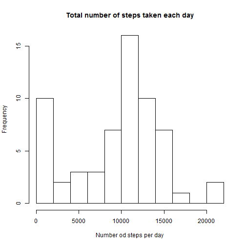
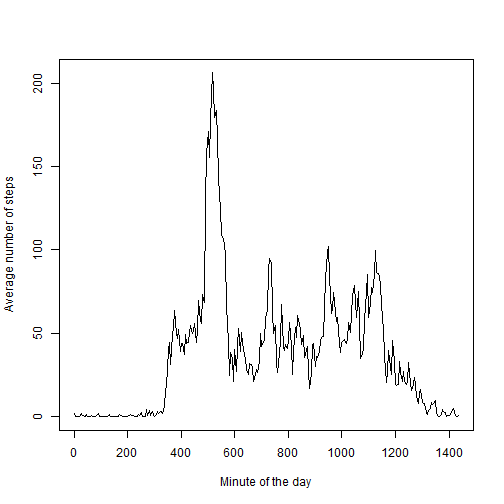
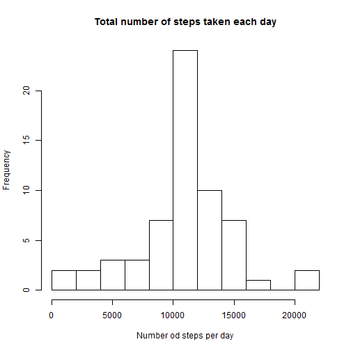

Reproducible Research - Peer Assessment 1
==========================

**Loading and preprocessing the data**

Here is the code for loading the data on activity monitoring and formatting it.


```r
df<-read.csv('activity.csv')
head(df)
```

```
##   steps       date interval
## 1    NA 2012-10-01        0
## 2    NA 2012-10-01        5
## 3    NA 2012-10-01       10
## 4    NA 2012-10-01       15
## 5    NA 2012-10-01       20
## 6    NA 2012-10-01       25
```

```r
df$date<-as.Date(df$date)
```

The interval variable is converted to the minute of the day


```r
df$interval<-(df$interval %/% 100)*60+df$interval %% 100
```


**What is mean total number of steps taken per day?**

The function below plots histogram of the total numer of steps taken each day and then calculates the average and median number of steps per day.


```r
spdx<-lapply(split(df$steps,df[,2]),sum,na.rm=TRUE)
spd<-unlist(spdx)
hist(spd,breaks=10, main='Total number of steps taken each day', xlab='Number od steps per day')
```

 

```r
spd_mean<-mean(spd)
spd_median<-median(spd)
```
Average number of steps per day is 9354.2295, while the median number of steps per day is 10395.

**What is the average daily activity pattern?**

The plot presents average number of steps taken in each 5-minute time interval, averaged by days.


```r
anspdx<-lapply(split(df$steps,df[,3]),mean,na.rm=TRUE)
anspd<-unlist(anspdx)
anspd<-data.frame(cbind(anspd,as.integer(names(anspd))))
names(anspd)<-paste(c('avg','minute'))
plot(anspd$minute, anspd$avg, type='l', ylab='Average number of steps', xlab='Minute of the day')
```

 

```r
max_anspd<-max(anspd$avg)
max_time<-anspd$minute[which.max(anspd$avg)]
```

The maximum average number of steps per 5-minute time interval is 206.1698 and it corresponds to the 5-minute interval starting at
515 minute of the day.

**Imputing missing values**

This part of the code calculates the number of missing values in the dataset


```r
rdf<-nrow(df)
w<-is.na(df)
missing<-sum(w)
pmissing<-missing/rdf*100
```

The number of rows in the dataset with missing values is 2304 out of 17568 (13.1148%).  
The missing data will be imputed with average value for a given 5-minute interval.


```r
df2<-df
for (i in 1:nrow(df2)){
  if (is.na(df2[i,1])) {df2[i,1]<-anspd$avg[anspd$minute==df2[i,3]]}
}
```

Here is the code for making a histogram of the total number of steps taken each day.


```r
spdx2<-lapply(split(df2$steps,df2[,2]),sum,na.rm=TRUE)
spd2<-unlist(spdx2)
hist(spd2,breaks=10, main='Total number of steps taken each day', xlab='Number od steps per day')
```

 

```r
spd2_mean<-mean(spd2)
spd2_median<-median(spd2)
```

Average number of steps per day with imputed missing values is is 1.0766 &times; 10<sup>4</sup>, while the median number of steps per day is 1.0766 &times; 10<sup>4</sup>.

The mean and median are higher that for the original data set with missing values. 


**Are there differences in activity patterns between weekdays and weekends?**


```r
#Creates variable indicatng weekends/weekdays
day<-as.POSIXlt(df2$date)$wday
wkd_ind<-(day==0 | day==6)
wkd<-factor(wkd_ind, labels=c('weekdays','weekend'))
```

